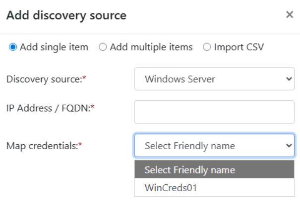
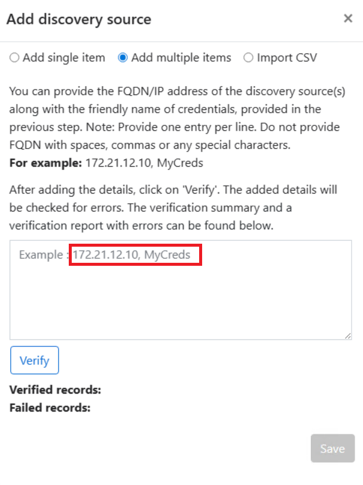
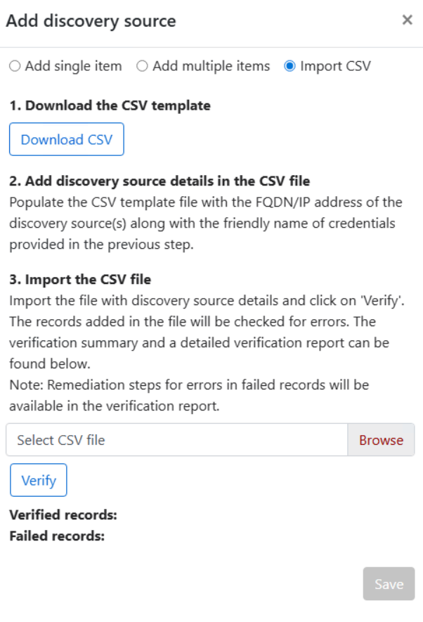

# Discover servers and workloads using Azure Migrate collector

Azure Migrate collector is a discovery tool to quickly discover servers and workloads across your IT estate without direct Azure connectivity. You deploy the collector on a Windows Server to scan VMware environments and physical or virtual servers. 

Azure Migrate collector can discover your VMware estate or individual Windows and Linux servers running on any hypervisor or public cloud. You can collect server configurations, performance metrics, installed software, SQL Server and PostgreSQL database instances, and web apps (.NET on IIS and Java on Tomcat). With no Azure connectivity required, you can scan the estate locally and upload data securely, saving time and avoiding complex networking or access approval requirements.

- Connectivity: Offline discovery
- Time to discovery: Quick to setup
- Assessment types: Lift and Shift, Modernize
- Performance based right-sized targets: Yes
- Guest and workload discovery: Yes
- Identify server dependencies: No
- Execute migrations: No

## Azure Migrate Collector deployment overview

- Create a new [Azure Migrate project](https://learn.microsoft.com/en-us/azure/migrate/quickstart-create-project?view=migrate)
- Download the Azure Migrate Collector
- Run the installer script and configure the collector
    - Provide vCenter credentials
    - Provide guest and database credentials
    - Validate credentials
    - Start data collection
    - Review collected data and diagnose errors by fixing network access issues, modifying user privileges, or adding new credentials
    - After addressing issues, enable Incremental data to attempt collection only on workloads where previous attempts failed
    - Export collected data
- Upload the collected data to an Azure Migrate project
- Enrich the discovery inventory
    - Apply custom tags like department, business unit, scope etc.
    - Apply reserved tags like dev, test, retain, retire
- After upload is successful, create business cases and assessments
- Import more inventory if needed

## Review before you start

- Set up the collector on a jump-box virtual machine (VM)
- Target environment:
    - vCenter
    - All versions of Windows and Linux
    - Webapps, SQL and PostgreSQL
- Prepare vCenter, guest & database accounts
    - **vCenter account:** Read only and guest operations (To collect server configurations & performance data of VMware machines.)
    - **Windows:** Domain account or administrator* account (To collect installed software, SQL & PostgreSQL database instance and web apps data.)
    - **Linux:** Root account* (To collect installed software, SQL & PostgreSQL database instance and web apps data.)
    - **SQL Server:** Domain account with SQL permissions (To collect SQL readiness data)
    - **Note for \*:** You can set up custom least privileged Windows, Linux, and SQL accounts by referring [this article](https://learn.microsoft.com/en-us/azure/migrate/best-practices-least-privileged-account?view=migrate).
- Azure Migrate Owner role is required to create Azure Migrate Project
- Follow all the [prerequisites](https://learn.microsoft.com/en-us/azure/migrate/how-to-discover-using-collector?view=migrate)
- Tag workloads correctly. It is very important for the assessment. You can see the details at the prerequisites document but also review [here](https://learn.microsoft.com/en-us/azure/migrate/assessment-prerequisites?view=migrate#tag-workloads-correctly).

## Create a new Azure Migrate project

- In the Azure portal, search for Azure Migrate.
- In Services, select **Azure Migrate**.
- In **Get started**, select **Create project**.

    

- In **Create project**, select the Azure subscription and resource group. Create a resource group if you don't have one.
- In **Project Details**, specify the project name, the geography in which you want to create the project and connectivity method. 
    - Review supported geographies for [public](https://learn.microsoft.com/en-us/azure/migrate/supported-geographies?view=migrate#public-cloud) and [government clouds](https://learn.microsoft.com/en-us/azure/migrate/supported-geographies?view=migrate#azure-government).
    - Create a project with [private endpoint connectivity](https://learn.microsoft.com/en-us/azure/migrate/discover-and-assess-using-private-endpoints?view=migrate#create-a-project-with-private-endpoint-connectivity).
    - Create a project in a [specific region](https://learn.microsoft.com/en-us/azure/migrate/quickstart-create-project?view=migrate#create-a-project-in-a-specific-region).
- Select **Create**.

    

- In **All projects**, review your **Azure Migrate Project**.

    

## Download the Azure Migrate Collector

- In the Azure Migrate, select **All Projects -> your Azure Migrate Project**.
- In your Azure Migrate Project, select **Start discovery -> Using collector**.

    

- In Discover, select **Download**.

    

- Alternatively, download the Azure Migrate collector installer [here](https://aka.ms/Migrate/DownloadCollector). 

## Run the installer script on your jump-box

- Connect to your jump-box.
- Copy and extract AzureMigratecollector.zip file to your jump-box.
- Launch PowerShell with administrative privileges.
- Change the directory to the extracted folder.
- Run the installer script:

    ```powershell
    .\AzureMigratecollector.ps1
    ```
- For the first installation, select the fresh (F) option. To upgrade the collector to a newer version, select the update (U) option.

    

- The installer script performs the following actions:
    - Adding\Updating Registry Keys at HKLM:\Software\Microsoft\AzureAppliance
    - Enabling IIS Role and other dependent features
        - WAS, WAS-Process-Model, WAS-Config-APIs, Web-Server, Web-WebServer, Web-Mgmt-Service, Web-Request-Monitor, Web-Common-Http, Web-Static-Content, Web-Default-Doc, Web-Dir-Browsing, Web-Http-Errors, Web-App-Dev, Web-CGI, Web-Health, Web-Http-Logging, Web-Log-Libraries, Web-Security, Web-Filtering, Web-Performance, Web-Stat-Compression, Web-Mgmt-Tools, Web-Mgmt-Console, Web-Scripting-Tools, Web-Asp-Net45, Web-Net-Ext45, Web-Http-Redirect, Web-Windows-Auth, Web-Url-Auth
    - Creating files
        - Config: C:\ProgramData\Microsoft Azure\Config
        - Offline Data: C:\ProgramData\Microsoft Azure\OfflineData
    - Installing
        - Microsoft Azure VMware Discovery Service.msi
        - Microsoft Azure VMware Assessment Service.msi
        - Microsoft Azure SQL Discovery and Assessment Service.msi
        - Microsoft Azure Web App Discovery and Assessment Service.msi
        - Microsoft Azure Server Discovery Service.msi
        - MicrosoftAzureApplianceConfigurationManager.msi
        - New Edge browser if not installed
    - Ensuring critical services for Azure Migrate appliance configuration manager are running
    - Launching Azure Migrate appliance configuration manager to start the onboarding process. You may use the shortcut placed on the desktop to manually launch **Azure Migrate appliance configuration manager**.

        

## Collect data

The same Azure migrate collector can be used to discover both VMware machines and physical servers that’s hypervisor agnostic. To collect data about physical servers, switch the fabric type at the top to physical. Otherwise keep it as VMWare to collect data from vCenter.

**Note:** After fresh install, all inputs may be grayed out. You may not e able to switch Fabric Type to Physical. You need to refresh the browser and then you will be able to switch.

### Collect data from physical servers

- Switch Fabric Type to **Physical**.

    

- Provide credentials for discovery of Windows and Linux physical or virtual servers
    - Review supported [types of credentials](https://learn.microsoft.com/en-us/azure/migrate/add-server-credentials?view=migrate#types-of-server-credentials-supported)
    - Review the required permissions for [Windows Credentials](https://learn.microsoft.com/en-us/azure/migrate/tutorial-discover-physical?view=migrate-classic#prepare-windows-server) and [Linux Credentials](https://learn.microsoft.com/en-us/azure/migrate/tutorial-discover-physical?view=migrate-classic#prepare-linux-server)

    

- Provide physical and virtual server details
    - [Learn](https://learn.microsoft.com/en-us/azure/migrate/migrate-appliance?view=migrate#discovery-and-collection-process) more about the prerequisites for physical server discovery
    - You can add a single item, or multiple items, or import CSV

    | Add single item | Add multiple items | Import CSV |
    |-----------------|-------------------|------------|
    |  |  |  |

    - Let's add the servers through CSV import
        - Download the CSV template
        - Add discovery source details in the CSV file. You can edit through Microsoft Excel or Notepad tools. See the screenshots below.
        - Import and verify the CSV file
        - Save the discovery source

        

        

    - The collector communicates with Windows servers using WinRM port 5986 (HTTPS) and Linux servers using port 22 (TCP). If HTTPS prerequisites aren't configured on Hyper‑V servers, it automatically switches to WinRM port 5985 (HTTP).
    - When you save, the collector validates connectivity to each server and shows the Validation status in the table. If validation fails, select Validation failed to review the error, fix the issue, and validate again. You can revalidate connectivity at any time before starting data collection or remove servers by selecting Delete.

        

- Provide credentials to collect SQL server instance readiness data
    - You can provide Windows, Domain accounts or Database specific user accounts for SQL Server. You can setup Database specific user accounts using an onboarding utility. [Learn more](https://learn.microsoft.com/en-us/azure/migrate/least-privilege-credentials?view=migrate).
    - Credential types are Domain Credentials, Linux (Non-domain), Windows (Non-domain), SQL Server Authentication

    

- Start data collection to collect inventory data

    

- Review collected data
    - Review the summary to understand the status and proportion of machines and worklaods that failed
    - Download the CSV file to review detailed error messages per server. Review the **Error ID** and **Error Message** columns in the CSV file. Columns in CSV file:
        - ServerName
        - WorkloadName
        - Category
        - Operating system
        - IPv6/IPv4
        - Source FQDN
        - Memory (MB)
        - Disks
        - Cores
        - Storage (GB)
        - Network adapters
        - MAC address
        - Boot type
        - Operating system type
        - Power status
        - Software
        - SQL instances
        - PGSQL instances
        - Web app
        - Severity
        - Message
        - Error ID
        - Error Message
        - Possible cause(s)
        - Recommended action(s)
        - Affected features    
    - Diagnose errors by fixing network access issues, modifying user privileges, or adding new credentials

    

- **Optional:** After resolving issues, run the data collection again.
    - Enable Collect incremental data only to attempt collection only on workloads where previous attemps failed. If disabled, full data collection runs.
    - Select **Start Data Collection** to run again

    

- Export collected data
    - (1) Click on Export.
    - (2) The ZIP file will saved in **C:\ProgramData\Microsoft Azure\OfflineData** folder.

    

## Upload the collected data to an Azure Migrate project

Import the zip file generated using collector

  - Open your Azure Migrate Project in Azure
  - Select Browse and select the ZIP file exported from your collector.
  - Once you have selected the right file, select import.
  - You'll be able to see the import status as it proceeds.
  - If you upload multiple files, the data will not be duplicated.

    

- Validate the import status

    

## Explore the inventory

- Review **All Inventory**

    

- It is recommended to set the tag before running the collector. Review the prerequisites above. If tags have not been set, you can set it here. There are custom and reserved tags. For example: 
    - **AzM_Environment:** If this tag is absent on the servers or workloads, they're considered as production workloads by default. If the workloads and servers operate in the dev/test environment, tag them with AzM.Environment: Dev.
    - **AzM_MigrationIntent:** To retain or retire workloads and servers, tag them with AzM.MigrationIntent: Retain or AzM.MigrationIntent: Retire. If the tag isn't applied, Azure Migrate treats the server or workload as a candidate for migration or modernization. 
    - You can export inventory (**1 - Export Data -> All inventory**), update **Environment** and **Migration Intent** columns in CSV file, and import CSV file to update tags (**2 - Tags -> Import tags**)

    

- Explore other inventories in detail
    - Infrastructure
    - Databases
    - Web apps
    - Software
    - Insights

    

- Explore applications
    - Azure Migrate now supports the automatic discovery of applications by grouping of inventory discovered using Collector.
    - Currently the process of automatically creating applications is performed only once after the inventory from collector is imported.
    - Each auto-discovered application represents a logical grouping of servers (and workloads running on those servers) automatically identified using server-naming patterns, inferred environments, and derived server roles.
    - Auto discovery of applications is currently only supported for collector-based inventory and not appliance or CSV import based inventory.

    

## Generate Report

Azure Migrate reports provide a summarized view of Migration and modernization opportunities to Azure. They include insights on workload readiness, security, and costs to help you prioritize workloads and make informed migration and modernization decisions. Reports can be generated after successful discovery and inventory enrichment.

**Note:** Report generation requires a business case, and a business case requires an assessment. Therefore, when you generate a report, Azure Migrate automatically creates the required assessment and business case.

- In your Azure Migrate Project, go to **Manage**, and then select **Reports**.
- Select **Generate Report**.
- Set the report **name**.
- Select the report **type**. For example:
    - Azure Modernization and Migration Report
    - Security Insights Report
- Select the **Migration preference**. For example: 
    - **Modernize (AI ready):** Generates report with the preference to Modernize (AI ready) workloads to PaaS and make them AI Ready. In case, the workload cannot be modernized to PaaS, it is recommended for Lift and Shift migration to Azure VM.
    - **Migrate:** Generates report for a quick lift and shift migration of worklaods to Azure VM.
    - **Pick** Modernize (AI ready).
- Select the **Configuration**. For example: 
    - **Define configuration:** Provide scope and settings to generate the report.
    - **Use configuration from an existing assessment:** Generate report using scope and settings from an existing assessment.
    - **Pick** Define configuration. It will create a **Business case** and **Assessment**. It is the recommended approach.
- Click on **Define configuration** at Report details.

    

- Click on **Add applications**.

    

- Select the **application** and click on **Add**.

    

- **Optional: **If you select the application, you don't need to select the workloads used by the application because all workloads used by the application will be included. If you want to add additional workload not used by the selected application, then you can select the workload(s) and click on Add selection. If you want to add workloads which is not used by the selected application(s), click on Add workloads

    

    Click on Add filter, select Application name(s) under Filter, Equals under Operator, and select all applications except the selected application(s) at previous step. Click Apply.

    

    You can select the workload(s) and click on Add selection.

    

- Click on Next.

    

- Work with your team and update **General** information and click on **Next**. You can leave all as default. These information will create TCO and saving for targeted Azure environment. 
    - Target and pricing
        - **Default target location:** Specify the target Azure region to which you want to migrate your workloads. Target right-sizing and costing recommendations would be done based on the selected location.
        - **Default environment:** Specify the environment type for the workloads you intend to migrate. You can avail Azure discounts for Dev/Test workloads.
        - **Currency:** Specify the currency in which you would like to get your cost estimates.
        - **Program/offer:** Specify the Microsoft licensing program you would like to use for cost estimation. Select Enterprise Agreement support if you have a negotiated Enterprise agreement with Microsoft.
        - **Default savings option:** Optimize your cost estimates by selecting the applicable commitment based savings option.
        - **Discount(%):** Specify the additional discount that you are eligible apart from savings options.
        - **Subscription:** Select a subscription for cost estimation, only EA (Enterprise agreement) /MCA (Microsoft Customer Agreement) subscriptions are listed here.
        - **Uptime: Day(s) per month / Hour(s) per day** Specify the time for which you expect the workloads to run.
    - Assessment criteria
        - **Sizing criteria:** Performance-based sizing considers the resource utilization and configuration attributes of workloads to right-sizes the targets accordingly for Azure. As on-premises sizing considers only configuration attributes of the on-premises workloads.
        - **Performance history:** The duration of performance history you would like to consider for the on-premises workloads.
        - **Percentile utilization:** The percentile value that you would like to consider for the performance history of the on-premises workloads.
        - **Comfort factor:** Comfort factor is a buffer that is added on top of utilization to account for situations like seasonal spikes in usage, insufficient performance data, likely increase in future usage, etc. [Learn more about comfort factor](https://go.microsoft.com/fwlink/?linkid=2342615).
    - Azure hybrid benefit: Apply Azure hybrid benefit and save up to 85% vs. pay-as-you-go rate by bringing your Windows Server licenses to Azure. [Review Azure hybrid benefit compliance](https://go.microsoft.com/fwlink/?LinkId=859786).
        -  **I have a Windows Server license:** Azure Hybrid Benefit allows Microsoft customers with Windows Server Software Assurance or Windows Server subscriptions to bring their licenses to Azure. [Learn more](https://go.microsoft.com/fwlink/?linkid=2257523)
        -  **I have Enterprise Linux subscriptions:** Azure Hybrid Benefit allows Microsoft customers with existing Enterprise Linux subscription to bring them to Azure. [Learn more](https://go.microsoft.com/fwlink/?linkid=2257523)
   -  Security
         -  **Include Microsoft Defender for cloud?:** Specify if you wish to include Defender for Server cost (Plan 2) with Microsoft Defender for cloud to protect your servers in Azure.

    

- Work with your team and update **Advanced** information and click on **Save**.
    - Infrastructure settings
    - Database settings
    - Web app settings
    - Application settings

    

- Click on **Generate Report**.

    

- It will create an **(1) Assessment**, **(2) Business case** and **(3) Report**. You can download and review the report.

    

## Next steps

- [Review the report](/assessment/azure-migrate-view-report.md)
- Review the business case
- Review the assessment