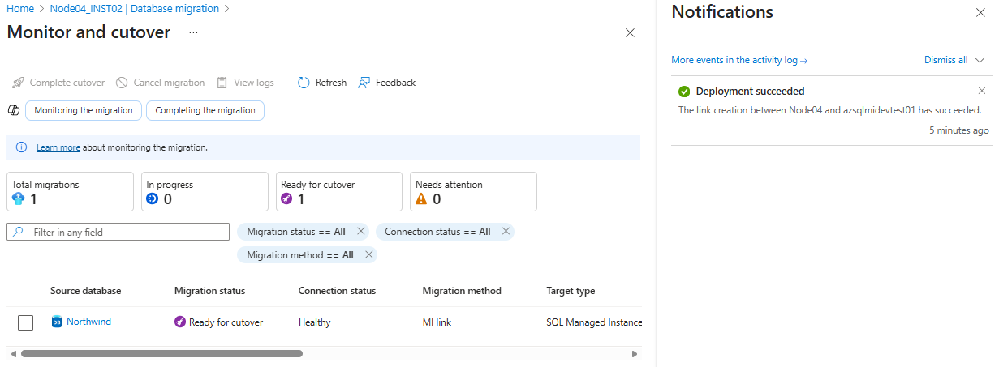
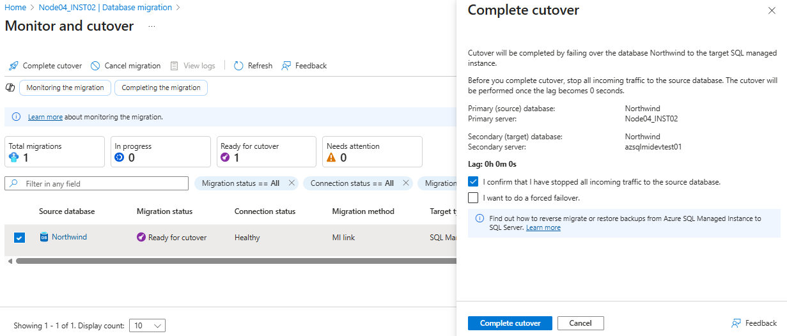

# Modernize Arc-enabled SQL Server to Azure SQL Managed Instance with Managed Instance Link

Learn how to migrate your SQL Server instance enabled by Azure Arc to Azure SQL Managed Instance through Managed Instance Link.

After your SQL Server instance is enabled by Azure Arc, you can assess your SQL Server data estate to identify an optimal SQL Managed Instance configuration. Then you can migrate your SQL Server databases to SQL Managed Instance directly from the Azure portal.

We will focus on Managed Instance Link (MI Link) which is near real-time replication using a distributed AG (lowest downtime; bi-directional/rollback options in some scenarios).

Think of it like this:

- Your on-prem SQL is the source lake
- Your Azure SQL MI is the destination lake
- MI Link is the pipe that keeps water flowing continuously
- The cutover = “turning off the lake on-prem and fully switching to the new Azure lake”

Reference:
- [Migration to Azure SQL Managed Instance - SQL Server migration in Azure Arc](https://learn.microsoft.com/en-us/sql/sql-server/azure-arc/migrate-to-azure-sql-managed-instance?view=sql-server-ver17&tabs=mi-link)
- [Prepare your environment for a link - Azure SQL Managed Instance](https://learn.microsoft.com/en-us/azure/azure-sql/managed-instance/managed-instance-link-preparation?view=azuresql&tabs=ssms)
- [Overview of the Managed Instance link](https://learn.microsoft.com/en-us/azure/azure-sql/managed-instance/managed-instance-link-feature-overview?view=azuresql)
- 

## Variables

```powershell
$serverNameSource="Node04"
$sqlServerNameSource="Node04_INST02"
$resourceGroupSource="rg-azurearc"
$serverNameTarget="azsqlmidevtest01"
$resourceGroupTarget="rg-sqlmi01"
```

## Prerequisites and validations

### Step 1: Review Azure Extension

- A supported instance of SQL Server enabled by Azure Arc with the Azure extension for SQL Server version 1.1.3211.337 or later. You can upgrade your extension by using the Azure portal or the Azure CLI.

- Check Extension Version Version Using Azure Portal

    ```text
    - Navigate to Machine - Azure Arc in the arc resource group
    - Select your Arc Machine (Node04)
    - Go to Setting and Extensions
    - Look for WindowsAgent.SqlServer
    - Check the Version column
    ```

### Step 2: Supported SQL Server version and edition

#### Source

- Confirm the SQL Server version and edition: Review [supported SQL Server versions](https://learn.microsoft.com/en-us/sql/sql-server/azure-arc/migration-sql-mi-prepare-link?view=sql-server-ver17#supported-sql-server-versions).
    - SQL Server 2016 and later on Windows Server 2016 and later. 
    - Enterprise, Standard, and Developer editions
    - In our scenario, we will migrate database from SQL Server 2019 and the minimum required cumulative update (CU) for SQL Server 2019 is CU 20.

    ```sql
    -- review version and edition
    SELECT @@VERSION AS VersionInfo;
    SELECT SERVERPROPERTY('Edition') AS Edition,
        SERVERPROPERTY('ProductVersion') AS ProductVersion,
        SERVERPROPERTY('ProductLevel') AS ProductLevel;
    ```

#### Target

- Both the General Purpose and Business Critical service tiers of Azure SQL Managed Instance support the Managed Instance link.

    ```powershell
    # Get details of your Managed Instance
    az sql mi show `
    --name $serverNameTarget `
    --resource-group $resourceGroupTarget `
    --query "{Name:name, Tier:sku.tier, Family:sku.family, vCores: sku.capacity}" `
    --output table
    ```

### Step 3: Configure the required permission

Configure the required permission to migrate your SQL Server instance to SQL Managed Instance through the Azure portal. [Review Details](https://learn.microsoft.com/en-us/sql/sql-server/azure-arc/migration-sql-mi-prepare-link?view=sql-server-ver17#permissions)

Check the Log On account to see the least privilege has been enabled or not:

- Open Services.msc, find **Microsoft Sql Server Extension Service**, and look at the **Log On As** column.
    - If it shows **NT SERVICE\SQLServerExtension**, least privilege is active.
    - If it shows **Local System**, least privilege is disabled.

How to operate SQL Server enabled by Azure Arc with least privilege 

- Option A: Follow the intructions [here](https://learn.microsoft.com/en-us/sql/sql-server/azure-arc/configure-least-privilege?view=sql-server-ver17). This is the recommended approach. If **az extension add --name arcdata** command fails with **An error occurred. Pip failed with status code 2. Use --debug for more information.**, then follow the other option.
- Option B: Switch the extension to the least privilege service account through windows services (Services.msc)


#### Let's run the agent extension service with least privilege

Check the Log On account:

- Open Services.msc, find **Microsoft Sql Server Extension Service**, and look at the **Log On As** column.
    - If it shows **NT SERVICE\SQLServerExtension**, least privilege is active.
    - If it shows **Local System**, least privilege is disabled.


### Step 4: Create a database master key in the master database

The link uses certificates to encrypt authentication and communication between SQL Server and SQL Managed Instance. The database master key protects the certificates used by the link. If you already have a database master key, you can skip this step.

```sql
-- Create a database master key in the master database. 
USE master;
CREATE MASTER KEY ENCRYPTION BY PASSWORD = '<strong_password>';

-- To make sure that you have the database master key,
USE master;
SELECT * FROM sys.symmetric_keys WHERE name LIKE '%DatabaseMasterKey%';
```

### Step 5: Enable availability groups

The link feature relies on the Always On availability groups feature, which is disabled by default. [Enable or disable Always On availability group feature](https://learn.microsoft.com/en-us/sql/database-engine/availability-groups/windows/enable-and-disable-always-on-availability-groups-sql-server?view=sql-server-ver17).
- Prior to SQL Server 2017, and Windows Server 2016, the instance had to reside on a Windows Server Failover Cluster (WSFC) node to enable the Always On availability group feature.
- Starting with SQL Server 2017 and Windows Server 2016, it's possible to enable the availability group feature even if the SQL Server instance does not reside on a Windows Server Failover Cluster.

If you have SQL Server 2016 and plan to enable the availability group, follow the instructions in [Prepare SQL Server 2016 prerequisites - Azure SQL Managed Instance link](https://learn.microsoft.com/en-us/azure/azure-sql/managed-instance/managed-instance-link-preparation-wsfc?view=azuresql).
- The steps described in this article are only mandatory for SQL Server 2016, as this version of SQL Server can't enable availability groups without Windows Server Failover Cluster present on the host Windows OS machine. 

Run the following script to confirm the availability groups feature is enabled.

```sql
-- Review AG feature state
DECLARE @IsHadrEnabled sql_variant = (select SERVERPROPERTY('IsHadrEnabled'))
SELECT
    @IsHadrEnabled as 'Is HADR enabled',
    CASE @IsHadrEnabled
        WHEN 0 THEN 'Availability groups DISABLED.'
        WHEN 1 THEN 'Availability groups ENABLED.'
        ELSE 'Unknown status.'
    END
    as 'HADR status'
```

If availability group is not enabled (0), then enable available groups. Distributed Availability Groups (DAGs), which MI Link uses, rely on the AG infrastructure.

If availability group is enabled (1), you can skip the instructions within this spep and proceed to the next step.

💡 Note: For our scenario, Node04 is the host server where we have INST02 which is SQL Server 2019. Node04 is not part of Windows Failover Cluster. [Review the Arc environment](../../setup/create-onprem-environment.md).

Enable Always On Availability Groups (NODE04\INST02)

  - Open **SQL Server Configuration Manager** on NODE04.
  - Go to **SQL Server Services** → right‑click on the right instance (INST02) → **Properties**.
  - Go to **Always on Availability Groups** tab.
  - Notice the message under **Windows Server Failover CLuster**, *This computer is not a node in failover cluster*.
  - On the **Always On Availability Groups** tab, check **Enable Always On Availability Groups**.
    - If you are using SQL Server 2016 (13.x), and if Enable Always On Availability Groups option is disabled with the message This computer is not a node in a failover cluster, follow the extra steps described in [Prepare SQL Server 2016 prerequisites - Azure SQL Managed Instance link](https://learn.microsoft.com/en-us/azure/azure-sql/managed-instance/managed-instance-link-preparation-wsfc?view=azuresql). Once you complete these steps in the article, come back and retry this step again.
  - Click on **Apply**, then **OK**, then **OK**.
  - Restart the SQL Server service for NODE04\INST02.

```sql
-- Verify the availability group
DECLARE @IsHadrEnabled sql_variant = (select SERVERPROPERTY('IsHadrEnabled'))
SELECT
    @IsHadrEnabled as 'Is HADR enabled',
    CASE @IsHadrEnabled
        WHEN 0 THEN 'Availability groups DISABLED.'
        WHEN 1 THEN 'Availability groups ENABLED.'
        ELSE 'Unknown status.'
    END
    as 'HADR status'
```

### Step 6: Enable Trace Flags

Managed Instance Link uses Always On Availability Groups, and specifically Distributed Availability Groups (DAGs), between:

- Your Arc-enabled SQL Server (source)
- Azure SQL Managed Instance (target)

To support the type of log transport, compression, and seeding that MI Link uses, SQL Server must enable two special behaviors controlled by these trace flags.

#### Trace Flag 1800

This trace flag optimizes performance when the log files for the primary and secondary replicas in an availability group are hosted on disks with different sector sizes, such as 512 bytes and 4 KB. If both primary and secondary replicas have a disk sector size of 4 KB, this trace flag isn't required. 

#### Trace Flag 9567

This trace flag enables compression of the data stream for availability groups during automatic seeding. The compression increases the load on the processor but can significantly reduce transfer time during seeding.

Enable -T1800 and -T9567 trace flags

- Open **SQL Server Configuration Manager** on NODE04.
- Go to **SQL Server Services** → right‑click on the right instance (INST02) → **Properties**.
- Go to **Startup Parameters** tab.
- Add the following startup parameters (one per line):
    - -T1800
    - -T9567
- Click on **Add** for each parameter.
- Click on **Apply**, then **OK**, then **OK**.
- Restart the SQL Server service for NODE04\INST02.

```sql
-- Valide trace flag (Status and Global should be 1)
DBCC TRACESTATUS (-1);
GO
```

### Step 7: Database recovery model, integrity, and readiness

- AG/MI Link requires **FULL** recovery and a clean, consistent database; otherwise seeding and log replay fail or lag.

    ```sql
    -- Check the recovery mode
    SELECT name, recovery_model_desc
    FROM sys.databases
    WHERE name = N'Northwind';

    -- if the recovery model is not FULL, set it to FULL
    ALTER DATABASE Northwind SET RECOVERY FULL WITH NO_WAIT;
    ```

- Integrity check

    ```sql
    DBCC CHECKDB('Northwind') WITH NO_INFOMSGS, ALL_ERRORMSGS;
    ```

- Seed backups (if needed by tool during initial sync):

    ```sql
    BACKUP DATABASE Northwind TO DISK = N'C:\Backups\Northwind-Node04-INST02.bak';
    ```
- Verify backup readability

    ```sql
    RESTORE VERIFYONLY FROM DISK = N'C:\Backups\Northwind-Node04-INST02.bak';
    ```

### Step 8: Import Azure-trusted root certificate authority keys to SQL Server

Managed Instance Link uses Always On availability group technology under the hood, but across different environments:

- Source: SQL Server (on-prem / Arc-enabled)
- Target: Azure SQL Managed Instance (MI)

Because these two systems communicate over the public internet or Azure backbone, SQL Server must be able to trust the TLS/SSL certificates that Azure SQL MI uses.

🧠 **Key Principle:**
SQL Server will not establish an AG / Distributed AG connection to a remote endpoint unless it fully trusts the certificate chain presented by the partner replica.

Azure SQL Managed Instance uses TLS certificates issued by:
- DigiCert Global Root G2
- Microsoft RSA Root Certificate Authority 2017

But your on-premises SQL Server does not automatically trust these Azure root CAs for Always On connections.

**What happens without these certificates?**

  If SQL Server does not trust the Azure MI certificate chain, you get errors like:
  - The certificate chain was issued by an authority that is not trusted
  - An error occurred while establishing a connection to the availability replica
  - The TLS/SSL handshake failed

And MI Link cannot be created.

This is because the AG endpoints use TLS-encrypted database mirroring endpoints over port 5022 (or custom).
If trust is not established → TLS handshake fails.

**Why Always On requires this trust?**

Always On Availability Groups use:
- Database Mirroring Endpoints
  - This uses TLS for secure data transport.
  - TLS requires:
      - Server presents certificate
      - Partner verifies certificate using trusted root CAs
- Distributed Availability Groups (MI Link uses these)
    - MI Link internally creates a Distributed AG:
        - Replica 1: SQL Server (Arc)
        - Replica 2: Managed Instance
    - A distributed AG requires external TLS trust because the two replicas live in different security domains.

**This is why SQL Server must import Azure CAs**

So SQL Server must import the same root CAs that Azure uses, so that SQL Server can say:

- “Yes, I trust the certificate coming from the Azure SQL Managed Instance endpoint.”

That is why Microsoft requires:
- DigiCert Global Root G2
- Microsoft RSA Root CA 2017

These are the roots that sign Azure SQL MI certificates.

**Download** the root CA keys from [Azure Certificate Authority details](https://learn.microsoft.com/en-us/azure/security/fundamentals/azure-ca-details#root-certificate-authorities). 
- At minimum, download the `**DigiCert Global Root G2**` and `**Microsoft RSA Root Certificate Authority 2017**` certificates and import them to your SQL Server instance.
- For a simplified setup, download all root CA certificates listed in Azure Root Certificate Authorities.
- Save the certificates local to the SQL Server instance, such as to the sample `C:\certs\<name of certificate>.crt` path, and then import the certificates from that path by using the following Transact-SQL script. Replace `<name of certificate>` with the actual certificate name: `DigiCert Global Root G2` and `Microsoft RSA Root Certificate Authority 2017`, which are the required names for these two certificates.

```sql
-- If sp_certificate_add_issue cannot be found, review minimum required servicing update through https://learn.microsoft.com/en-us/azure/azure-sql/managed-instance/managed-instance-link-feature-overview?view=azuresql#version-supportability

-- These are root of trust certificates so that SQL Server trusts MI’s public certs.
CREATE CERTIFICATE [DigiCertPKI] FROM FILE = 'C:\certs\DigiCertGlobalRootG2.crt'
DECLARE @CERTID int
SELECT @CERTID = CERT_ID('DigiCertPKI')
EXEC sp_certificate_add_issuer @CERTID, N'*.database.windows.net';
GO
CREATE CERTIFICATE [MicrosoftPKI] FROM FILE = 'C:\certs\Microsoft RSA Root Certificate Authority 2017.crt'
DECLARE @CERTID int
SELECT @CERTID = CERT_ID('MicrosoftPKI')
EXEC sp_certificate_add_issuer @CERTID, N'*.database.windows.net';
GO
```

Verify all the created certificates by using the following dynamic management view (DMV):

```sql
USE master
SELECT * FROM sys.certificates
```

### Step 9: Network connectivity between source and target

 You must have network connectivity between SQL Server and SQL Managed Instance. 

When we created Azure SQL Managed Instance (MI), we created network peering between SQL Arc and SQL MI environments. [Review the SQL MI environment create guidance](../../setup/create-azuresqlmi-environment.md).

```text
# Peer sqlmi01 to onprem
az network vnet peering create `
  --name sqlmi01-to-onprem `
  --resource-group $resourceGroup `
  --vnet-name $vnet `
  --remote-vnet "/subscriptions/$subscriptionId/resourceGroups/$onpremResourceGroup/providers/Microsoft.Network/virtualNetworks/$onpremVNet" `
  --allow-vnet-access `
  --allow-forwarded-traffic

# Peer onprem to sqlmi01
az network vnet peering create `
  --name onprem-to-sqlmi01 `
  --resource-group $onpremResourceGroup `
  --vnet-name $onpremVNet `
  --remote-vnet "/subscriptions/$subscriptionId/resourceGroups/$resourceGroup/providers/Microsoft.Network/virtualNetworks/$vnet" `
  --allow-vnet-access `
  --allow-forwarded-traffic
```

### Step 10: Network ports between the environments

#### Source (SQL Server Host)

Enable Inbound and Outbouns rules on all firewalls hosting the SQL Server. If there is SQL FCI and/or SQL AG, consider all the host servers.
- Inbound port 5022 opened to receive traffic from the source IP range of the MI subnet /24 (Our scenario is 10.3.0.0/24)
- Outbound ports 5022, and the port range 11000-11999 opened to send traffic to the destination IP range of MI subnet (Our scenario is 10.3.0.0/24)

```powershell
    # Node04
    New-NetFirewallRule -DisplayName "SQL_TCP_1433" -Direction Inbound -Protocol TCP -LocalPort 1433 -Action Allow -Profile Any
    New-NetFirewallRule -DisplayName "SQL_UDP_1434" -Direction Inbound -Protocol UDP -LocalPort 1434 -Action Allow -Profile Any
    New-NetFirewallRule -DisplayName "SQL_TCP_62541" -Direction Inbound -Protocol TCP -LocalPort 62541 -Action Allow -Profile Any
    New-NetFirewallRule -DisplayName "SQL_TCP_49859" -Direction Inbound -Protocol TCP -LocalPort 49859 -Action Allow -Profile Any
    New-NetFirewallRule -DisplayName "SQL_TCP_5022" -Direction Inbound -Protocol TCP -LocalPort 5022 -Action Allow -Profile Any
    New-NetFirewallRule -DisplayName "SQL_TCP_5022_Outbound" -Direction Outbound -Protocol TCP -LocalPort 5022 -Action Allow -Profile Any    
    New-NetFirewallRule -DisplayName "SQL_TCP_5023" -Direction Inbound -Protocol TCP -LocalPort 5023 -Action Allow 
    New-NetFirewallRule -DisplayName "SQL_TCP_5023_Outbound" -Direction Outbound -Protocol TCP -LocalPort 5023 -Action Allow -Profile Any 
    New-NetFirewallRule -DisplayName "MI-Link-Outbound-11000-11999" `
    -Direction Outbound `
    -LocalPort 11000-11999 `
    -Protocol TCP `
    -Action Allow `
    -Profile Any
    New-NetFirewallRule -DisplayName "MI-Link-Inbound-11000-11999" `
    -Direction Inbound `
    -LocalPort 11000-11999 `
    -Protocol TCP `
    -Action Allow `
    -Profile Any 
```

#### Target (Azure SQL MI)

The Network Security Group (NSG) rules on the subnet hosting SQL Managed Instance needs to allow:
- Inbound port 5022 and port range 11000-11999 to receive traffic from the source SQL Server IP
- Outbound port 5022 to send traffic to the destination SQL Server IP


## Migrate to Azure SQL Managed Instance

### Step 1: Assess source instance

- Go to SQL Server Instance Resource 
  - portal.azure.com
  - Search for **SQL Server Instances**
  - Select the right instance for the migration scenario. Based on our setup through [create-onprem-environment](../../setup//create-onprem-environment.md) and [enable-arc](../non-azure-to-arc/enable-arc.md), we select Node04\INST02 and resource name is Node04_INST02.
- Expand **Migration** and select **Database migration**
- Under **Welcome to Database migration**, select **View report** under **Assess source instance** to open the Assessments pane.
  - If the assessment has not been run before, click on **Run assessment** to start a new assessment.
- Under Azure SQL MI, click on **View assessment details**.
  - Review the results for **Instance compatibility** and **Database compatibility**.
  - Review the **Suggested target configuration** and **Monthly cost estimate**.

### Step 2: Select target

- On the Assessments pane, under Azure SQL MI, select **Create or select target**.
  - Target exists: Select **Yes, I have already created a target**. We have created Azure SQL MI through [create-azuresqlmi-environment](../../setup/create-azuresqlmi-environment.md).
  - Target type: Azure SQL Managed Instance
  - Select the right
    - Subscription
    - Resource group
    - Region
    - Managed instance
  - Click on **Select target** to proceed to the next page.

### Step 3: Migrate data

- On the **Database migration** pane and under **Welcome to Database migration**, select **Migrate data**.
- On the **New data migration** pane, choose **Migrate using real-time replication - MI link** and click on **Select**.
- On the **Select source databases** tab, select the database that you want to migrate, and then click on **Next: Settings** to proceed to the next page.
- On the Settings tab, provide the name of the MI link. The name of the availability group is autogenerated, customize it, only if you need to. Click on **Test connection** to test the connection to the source SQL Server instance. Once you see **Network connection validation succeeded**, then click on **Next: Review + Create** to proceed to the next page.
  - MI link name: DAG_Nothwind
  - Source availability group name: AG_Northwind
- On the **Review + create** tab, review the settings, and check for warnings. Remediate the issues if anything is blocking the migration. If you see the following issues, you can ignore them. You dont need to create the endpoint and secure it as it will be done by the MI Link.
    - Always On mirroring endpoint does not exist on SQL Server. Create the endpoint and try again.
    - Always On mirroring endpoint has not been secured with an authentication certificate.
    - Always On mirroring endpoint encryption is not enabled. Enable the encryption and try again.
    - Always On Mirroring Endpoint encryption algorithm is not AES. Change the encryption algorithm to AES and try again.
- Click on **Start data migration** to proceed to the next phase.
- Click on **Monitor Migrations**

### Step 4: Monitor and cutover
- Once deployment is succeeded, you can review the Migration status.

   

- You can complete cutover.

   