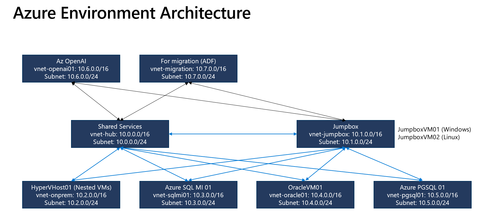
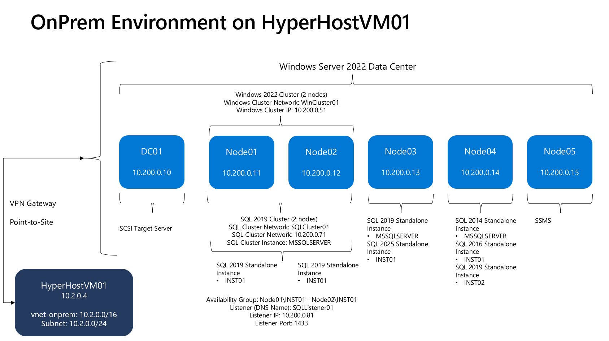

# Azure Environment Overview

This page provides a high-level view of the current Azure Lab environment including virtual networks, workloads, and VNet peering configuration.

Use it to understand the logical topology before deploying or extending additional workloads.

## Azure Environment

## Workloads

| Resource Name       | Resource Group  | VNet            | Subnet                         | Public IP              | Private IP | Description                                   |
| ------------------- | --------------- | --------------- | ------------------------------ | ---------------------- | ---------- | --------------------------------------------- |
| `JumpboxVM01`       | `rg-jumpbox`    | `vnet-jumpbox`  | `subnet-vnet-jumpbox-backend`  | `<assigned-public-ip>` | `10.1.0.4` | Jumpbox VM                                    |
| `OracleVM01`        | `rg-oracle01`   | `vnet-oracle01` | `subnet-vnet-oracle01-backend` | `No Public IP`         | `10.5.0.4` | Oracle-Linux 8.10 and Oracle Database 21c XE  |
| `azpgsqlprod01`     | `rg-pgsql03`    | `vnet-pgsql03`  | `subnet-vnet-pgsql03-backend`  | `No Public IP`         | `10.6.0.4` | Azure Database for PostgreSQL Flexible Server |
| `AzOpenAIModern01 ` | `rg-openai01`   | `vnet-openai01` | `subnet-vnet-openai01-backend` | `No Public IP`         | `10.7.0.4` | Azure OpenAI with gpt-4.1 model               |

## Private DNS Zones

| Private DNS Zones                         | Resource Group  |
| ----------------------------------------- | --------------- |
| `privatelink.postgres.database.azure.com` | `rg-hub`        |
| `privatelink.openai.azure.com`            | `rg-hub`        |
| `privatelink.database.windows.net`            | `rg-hub`        |

## Private DNS Links

| Virtual Network | Private DNS Link Name             | Private DNS Zones                         | Resource Group  |
| --------------- | --------------------------------- | ----------------------------------------- | --------------- |
| `vnet-jumpbox`  | `link-to-vnet-jumpbox-postgresql` | `privatelink.postgres.database.azure.com` | `rg-hub`        |
| `vnet-jumpbox`  | `link-to-vnet-jumpbox-openai`     | `privatelink.openai.azure.com`            | `rg-hub`        |
| `vnet-jumpbox`  | `link-to-vnet-jumpbox-azuresql`     | `privatelink.database.windows.net`            | `rg-hub`        |
| `vnet-pgsql01`  | `link-to-vnet-pgsql01-postgresql` | `privatelink.postgres.database.azure.com` | `rg-hub`        |
| `vnet-openai01` | `link-to-vnet-openai01-openai`    | `privatelink.openai.azure.com`            | `rg-hub`        |
| `vnet-sqlmi01` | `link-to-vnet-sqlmi01-azuresqlmi`    | `privatelink.database.windows.net`            | `rg-hub`        |

